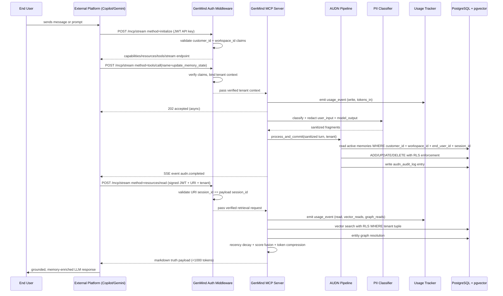

# GenMind Architecture Specification

## 1) System Goals

GenMind is a centralized Context-as-a-Service memory infrastructure exposed as a remote MCP server over Streamable HTTP.
It is designed to plug directly into external orchestration platforms (Copilot Studio, GitHub Copilot Workspace, Gemini Enterprise) as a standards-based memory provider.

Primary goals:
- Enforce strict multi-tenant data isolation on every read/write path.
- Manage customers and workspaces with full lifecycle: create, suspend, offboard, audit.
- Authenticate all API consumers using scoped JWTs with customer + workspace claim binding.
- Track every request with granular usage events to enable billing and consumption reports.
- Protect end-user privacy through PII minimization, purpose-limited access, and deletion workflows.
- Transform noisy conversational logs into canonical memory state through AUDN.
- Retrieve high-fidelity context via vector + graph + recency hybrid ranking.
- Emit compact markdown truth payloads under 1,000 tokens.
- Provide operational and per-customer dashboards for system health and business intelligence.
- Provide retrieval-quality SLO dashboards and alert signals from persisted optimizer telemetry.
- Support deterministic typed-claim backfill jobs with dry-run and checkpoint tracking.

## 2) High-Level Component Layout

- Identity and Auth Layer:
  - Customer and workspace management REST API.
  - OAuth2 Client Credentials and signed JWT API key issuance and validation.
  - RBAC for internal operator roles: support, ops, security, finance.
- API Layer (FastAPI):
  - Unified MCP stream endpoint: `POST /mcp/stream` for initialize/resources/tools calls.
  - Compatibility endpoints: initialization/resources/tools routes for diagnostics and controlled migrations.
  - SSE event channel for asynchronous ingestion status.
  - Auth middleware that validates and binds tenant claims before any handler runs.
- Orchestration Layer:
  - AUDN pipeline (Add/Update/Delete/None) for state mutation decisions.
  - Memory engine for hybrid retrieval and context distillation.
  - Usage event emitter attached to all business-critical routes.
  - Retrieval telemetry emitter attached to every MCP read/write-response route.
  - PII classifier and redaction pipeline on ingestion path.
- Data Layer (PostgreSQL + pgvector):
  - customers and workspaces tables with plan and status lifecycle.
  - api_credentials table with hashed key storage and rotation tracking.
  - Vector similarity index for semantic memory retrieval.
  - Relational memory tables with Row-Level Security enforcing tenant bounds.
  - Entity graph tables for explicit relationship traversal.
  - usage_events and daily aggregates for consumption reporting.
  - claim_backfill_checkpoints for idempotent projection runs and operations visibility.
  - audn_audit_log and admin_audit_log for full change history.

  ### 2b) V2 Product Posture

  GenMind V2 is optimized for clean forward design (not backward-compatibility shims):

  - **MCP Protocol Lock**: V2 enforces `protocol_version='2026-01-01'` and rejects all legacy client variants.
    No runtime version negotiation, no fallback modes, no shim logic.
  - Retrieval quality is treated as a first-class product surface, not internal-only logs.
  - Typed claim projection is canonical for deterministic fact resolution.
  - Backfill and replay are explicit operations with observable checkpoints.
  - New admin quality endpoints are part of baseline operations for first-customer readiness.
- Observability Layer:
  - OpenTelemetry instrumentation across API and workers.
  - Prometheus metrics and Grafana dashboards (operational SRE view).
  - Materialized analytics views and Metabase/Superset reports (business view).

## 3) MCP Runtime Sequence (Full End-to-End Flow)



  ### 3a) Single-Roundtrip MCP Option

  For maker platforms that want a simpler integration, GenMind also supports a synchronous one-shot MCP tool:

  - Tool name: `send_and_receive`
  - Surface: `POST /mcp/stream` with `method=tools/call`, or direct `POST /mcp/tools/send_and_receive`
  - Purpose: commit one full conversational turn through AUDN and immediately return refreshed tenant-scoped context in the same response

  One-shot sequence:

  1. Platform sends `user_input`, `model_output`, tenant tuple, and optional retrieval `query`
  2. GenMind validates `customer_id + workspace_id` claims and exact tenant payload
  3. AUDN runs synchronously and applies Add/Update/Delete/None decisions
  4. Hybrid retrieval runs immediately on the updated memory state
  5. GenMind returns:
     - decision summary
     - selected retrieval items
     - compact markdown truth payload

  This path is additive and does not replace the existing async `update_memory_state` plus `resources/read` flow.

## 4) Identity Model and Multi-Tenant Isolation Contract

### 4a) Four-Layer Identity Hierarchy

| Layer | ID Field | Description |
|---|---|---|
| GenMind Customer | `customer_id` | Your paying B2B customer account |
| Workspace | `workspace_id` | Their integration instance (dev, prod, region) |
| End User | `end_user_id` | Their end user within that workspace |
| Session | `session_id` | One conversation or interaction unit |

> These four IDs replace the previous (client_id, agent_id, session_id) tuple.
> `customer_id` maps to former `client_id`. `workspace_id` maps to former `agent_id`.
> `end_user_id` is new and mandatory for privacy-correct per-user memory scoping.

### 4b) Customer Lifecycle

Customer states: `active` → `suspended` → `offboarded`

Customer creation flow:
1. Internal operator creates customer via admin API.
2. System provisions workspace_id and issues signed API credentials.
3. Customer integrates MCP endpoints using credentials.
4. Usage events begin accumulating immediately on first request.

### 4c) Isolation Enforcement Rules

- No database read or write may execute without all four IDs present and verified.
- Resource URI `session_id` must exactly match `session_id` in the verified JWT claim.
- Background AUDN jobs must carry explicit tenant context, never infer from global state.
- SSE events must include full tenant metadata for downstream subscriber filtering.
- Row-Level Security policies enforce customer_id + workspace_id at the DB layer as a second gate after application-layer checks.
- Memory scoping rules:
  - End-user memory: scoped to `customer_id + workspace_id + end_user_id`
  - Session memory: scoped to full four-ID tuple
  - Shared workspace memory: only when explicitly flagged and stored with scope=workspace

### 4d) Authentication and Authorization

Authentication method: OAuth2 Client Credentials flow with signed JWT tokens.

JWT required claims:
- `sub`: workspace credential ID
- `customer_id`: customer boundary
- `workspace_id`: workspace boundary
- `scopes`: list of allowed operations (memory:read, memory:write, admin:*)
- `exp`: short-lived expiry (default: 1 hour)

Auth middleware enforces:
1. Signature verification using JWKS.
2. Expiry and not-before checks.
3. Scope-to-endpoint binding.
4. Claim-to-request tenant context binding before any handler executes.
5. Rate limiting per workspace credential.

Internal operator roles (RBAC):
- `ops`: infra and system health read access.
- `support`: customer metadata read, no raw memory content access.
- `security`: audit log read, compliance exports.
- `finance`: usage aggregates and billing data only.

## 5) Database: Strategy, Engine, and Schema

### 5a) Engine Choice

Primary database: **PostgreSQL 16+ with pgvector extension**.

Rationale:
- Strong ACID transactions for multi-tenant safety.
- Row-Level Security for DB-layer tenant isolation.
- pgvector for embedding similarity search (ivfflat/hnsw indexes).
- JSONB for flexible entity attributes.
- Native partitioning for usage_events and audit logs at scale.
- Mature ecosystem, proven compliance tooling, wide managed hosting support.

### 5b) Hosting and Operations

Recommended deployment: **AWS Aurora PostgreSQL (Multi-AZ)** or **RDS PostgreSQL**.
- Multi-AZ for HA and automatic failover.
- Read replica dedicated to analytics queries and dashboard workloads.
- Point-in-time recovery enabled (PITR).
- Automated daily snapshots retained 30 days (adjustable per plan).
- Alembic migrations with mandatory review and rollback scripts.
- Partition large tables (usage_events, audn_audit_log) by month and customer_id.

Optional analytics sink for high-volume reporting:
- Start with Postgres materialized views on the read replica.
- Migrate to ClickHouse or BigQuery when daily usage_events exceed ~10M rows.

### 5c) Row-Level Security Policy Contract

All sensitive tables must have RLS enabled with policies of the form:

```sql
CREATE POLICY tenant_isolation ON memory_records
  USING (
    customer_id = current_setting('app.customer_id')
    AND workspace_id = current_setting('app.workspace_id')
  );
```

The application auth middleware must set these session variables from verified JWT claims before executing any query. This provides a second isolation gate independent of application logic.

### 5d) Complete Database Schema

#### Table: customers
- `customer_id` (text, PK)
- `display_name` (text)
- `status` (text: active|suspended|offboarded)
- `plan` (text: starter|growth|enterprise)
- `region` (text: us-east-1|eu-west-1|ap-southeast-1)
- `retention_days` (int, default 90)
- `created_at` (timestamptz)
- `updated_at` (timestamptz)

#### Table: workspaces
- `workspace_id` (text, PK)
- `customer_id` (text, FK → customers, indexed)
- `display_name` (text)
- `environment` (text: dev|staging|prod)
- `status` (text: active|suspended)
- `monthly_request_quota` (bigint)
- `created_at` (timestamptz)

#### Table: api_credentials
- `credential_id` (text, PK)
- `workspace_id` (text, FK → workspaces, indexed)
- `customer_id` (text, indexed)
- `key_hash` (text, bcrypt or SHA-256 of raw key — raw key never stored)
- `key_prefix` (text, first 8 chars for display)
- `scopes` (text[])
- `last_used_at` (timestamptz, nullable)
- `rotated_at` (timestamptz, nullable)
- `expires_at` (timestamptz, nullable)
- `is_active` (boolean)
- `created_at` (timestamptz)

#### Table: memory_records
- `memory_id` (text, PK)
- `customer_id` (text, indexed, RLS)
- `workspace_id` (text, indexed, RLS)
- `end_user_id` (text, indexed)
- `session_id` (text, indexed)
- `content` (text — PII-redacted before storage)
- `confidence` (float)
- `embedding` (vector)
- `is_active` (boolean)
- `source` (text)
- `created_at` (timestamptz)
- `updated_at` (timestamptz)

Indexes:
- Composite btree: `(customer_id, workspace_id, end_user_id, session_id, is_active)`
- ivfflat/hnsw on `embedding`

#### Table: entity_nodes
- `entity_id` (text, PK)
- `customer_id` (text, indexed, RLS)
- `workspace_id` (text, indexed, RLS)
- `end_user_id` (text, indexed)
- `session_id` (text, indexed)
- `entity_type` (text)
- `canonical_name` (text)
- `attributes` (jsonb)
- `confidence` (float)
- `last_seen_at` (timestamptz)

#### Table: entity_edges
- `edge_id` (bigserial, PK)
- `customer_id` (text, indexed, RLS)
- `workspace_id` (text, indexed, RLS)
- `end_user_id` (text, indexed)
- `session_id` (text, indexed)
- `source_entity_id` (text)
- `target_entity_id` (text)
- `relation_type` (text)
- `weight` (float)
- `updated_at` (timestamptz)

#### Table: usage_events (append-only, partitioned by month)
- `event_id` (bigserial, PK)
- `customer_id` (text, indexed)
- `workspace_id` (text, indexed)
- `end_user_id` (text, indexed)
- `session_id` (text)
- `request_id` (text)
- `endpoint` (text)
- `tokens_in` (int)
- `tokens_out` (int)
- `context_tokens` (int)
- `vector_reads` (int)
- `graph_reads` (int)
- `memory_writes` (int)
- `latency_ms` (int)
- `status_code` (int)
- `occurred_at` (timestamptz, partition key)

#### Table: usage_daily_aggregates (materialized summary)
- `agg_id` (bigserial, PK)
- `customer_id` (text, indexed)
- `workspace_id` (text, indexed)
- `date` (date, indexed)
- `total_requests` (bigint)
- `total_tokens_in` (bigint)
- `total_tokens_out` (bigint)
- `total_context_tokens` (bigint)
- `total_vector_reads` (bigint)
- `total_memory_writes` (bigint)
- `active_end_users` (int)
- `avg_latency_ms` (float)

#### Table: audn_audit_log (partitioned by month)
- `audit_id` (bigserial, PK)
- `customer_id` (text, indexed)
- `workspace_id` (text, indexed)
- `end_user_id` (text, indexed)
- `session_id` (text, indexed)
- `action` (text: add|update|delete|none)
- `candidate_fact` (text)
- `target_memory_id` (text, nullable)
- `confidence` (float)
- `reason` (text)
- `created_at` (timestamptz, partition key)

#### Table: admin_audit_log
- `log_id` (bigserial, PK)
- `operator_id` (text)
- `operator_role` (text)
- `action` (text)
- `target_resource` (text)
- `target_id` (text)
- `ip_address` (text)
- `occurred_at` (timestamptz)

## 6) AUDN Decision Loop

1. Extract candidate facts from user_input + model_output (after PII redaction).
2. Discard low-signal noise into None.
3. Compare candidates with active tenant-scoped memory records (full 4-ID scope).
4. Assign action:
   - Add: fact is new and high signal.
   - Update: fact overlaps existing memory but indicates changed value.
   - Delete: user correction invalidates existing memory.
   - None: duplicate, filler, or low-confidence noise.
5. Persist mutation, write audn_audit_log entry, emit SSE completion event.

## 7) Hybrid Retrieval + Scoring

Scoring formula:

$$\text{FinalScore} = 0.5 \times \text{SemanticScore} + 0.3 \times \text{GraphScore} + 0.2 \times \text{RecencyScore}$$

RecencyScore uses exponential decay:

$$\text{RecencyScore} = e^{-\lambda \cdot \text{age\_hours}}, \quad \lambda = \frac{\ln 2}{\text{half\_life\_hours}}$$

Default half-life: **168 hours (7 days)**, tunable per customer retention policy.

## 8) Truth Payload Contract

- Markdown, dense factual bullet list, sorted by final score descending.
- Strict token cap: <= 1,000 estimated tokens.
- Include freshness metadata where useful.
- Exclude inactive/deleted facts and redacted PII markers.
- Payload is intended for direct LLM prompt injection with minimal post-processing.

## 9) Security Architecture

### Defense-in-Depth Layers

| Layer | Control |
|---|---|
| Network | TLS 1.2+ enforced, no plaintext |
| Auth | Short-lived JWT, JWKS rotation, scope binding |
| Application | Tenant tuple validation on every handler |
| Database | Row-Level Security, session variable binding |
| Storage | Encryption at rest, optional per-customer KMS keys |
| Secrets | Secrets manager (AWS Secrets Manager or Vault), no plaintext env secrets |
| Audit | All admin access logged to admin_audit_log |

### API Credential Security

- Raw API keys are **never stored**. Only a SHA-256 hash is persisted.
- Key prefix (first 8 chars) stored for human identification in UI.
- Keys expire by plan policy. Rotation required on compromise.
- Credential issuance and rotation is an auditable admin action.

### PII and Data Minimization

- PII classifier runs on every ingestion fragment before embedding or storage.
- Detected PII entities are pseudonymized or redacted based on sensitivity tier.
- Raw sensitive fragments are stored separately with a short-retention policy.
- Access to raw user content requires elevated `memory:raw_read` scope (restricted role).

### Crypto Standards

- TLS 1.2+ on all endpoints, TLS 1.3 preferred.
- At-rest encryption: AES-256 (provider-managed by default, customer-managed KMS optional).
- Credential hashing: PBKDF2-HMAC-SHA256 with per-key salt.
- JWKS RS256 for JWT signing, rotated on schedule.

## 10) Usage Tracking and Consumption Reporting

Every business-critical request emits an immutable usage_event record containing:
- Full tenant tuple (customer_id, workspace_id, end_user_id, session_id)
- Endpoint, status code, latency_ms
- tokens_in, tokens_out, context_tokens
- vector_reads, graph_reads, memory_writes

Daily aggregation jobs roll up raw events into `usage_daily_aggregates` for efficient reporting.

Consumption reports are available per:
- customer (billing-level rollup)
- workspace (integration-level breakdown)
- end_user (privacy-aware, aggregate only)
- endpoint and time range

Raw usage_events are retained for the customer's plan retention window, then purged.

## 11) Dashboards

### 11a) Operational Dashboard (SRE / Infra)
Tooling: **Prometheus + Grafana**

Key panels:
- API p50/p95/p99 latency by endpoint.
- Error rate and 5xx distribution.
- AUDN action distribution (Add/Update/Delete/None ratios).
- Retrieval hit rate and stale-hit ratio.
- SSE subscriber count and drop rate.
- Queue depth for background AUDN workers.
- DB connection pool utilization.

### 11b) Business Dashboard (Customer Success / Finance)
Tooling: **Postgres materialized views + Metabase or Superset**

Key reports:
- Total requests per customer and workspace, daily/weekly/monthly.
- Active end users per customer.
- Token and retrieval unit consumption trends.
- Top workspaces by usage (for upsell signals).
- Anomaly alerts on sudden usage spikes.
- Per-customer retention compliance status.

### 11c) Per-Customer Self-Service (future)
- Customers can view their own workspace consumption via API or UI.
- Scoped read-only API using their own credentials.
- No cross-customer data visible.

## 12) Privacy and End-User Data Rights

### Privacy by Default

- Data minimization: store only what memory quality requires.
- Purpose limitation: memory, analytics, and support access domains are separated.
- No raw user content is accessible to internal operators without explicit elevated permission and audit log entry.

### Retention and Deletion

- Default retention: 90 days (configurable per customer plan).
- Hard delete on customer offboarding: all customer_id-scoped rows purged within 30 days.
- Right-to-delete (GDPR Article 17): end_user_id targeted purge across all tables.
- Deletion requests are async, acknowledged immediately, completed within SLA.
- Deletion events are written to admin_audit_log for compliance evidence.

### Data Residency

- Deployment is region-bound. Customer data does not leave their assigned region.
- Region is set at customer creation and is immutable.
- Cross-region replication is disabled by default.

### Compliance Posture

- Controls designed for SOC 2 Type II and GDPR readiness.
- DPA (Data Processing Agreement) templates maintained per customer tier.
- Audit logs are tamper-evident (append-only, no update or delete allowed on log tables).
- Annual penetration test and vulnerability disclosure policy.
